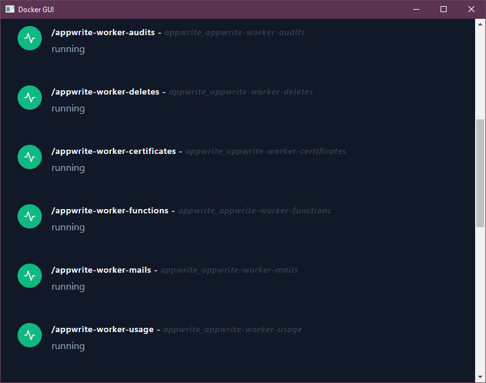

# docker-gui

Proof of concept for a Docker Desktop clone for Linux with [tauri](https://tauri.studio).

*Note that you will need to have [Node.js](https://nodejs.org) installed.*

## Get started

```bash
cd svelte-app
npm install
npm run dev
npm run tauri dev
```

## Screenshot

